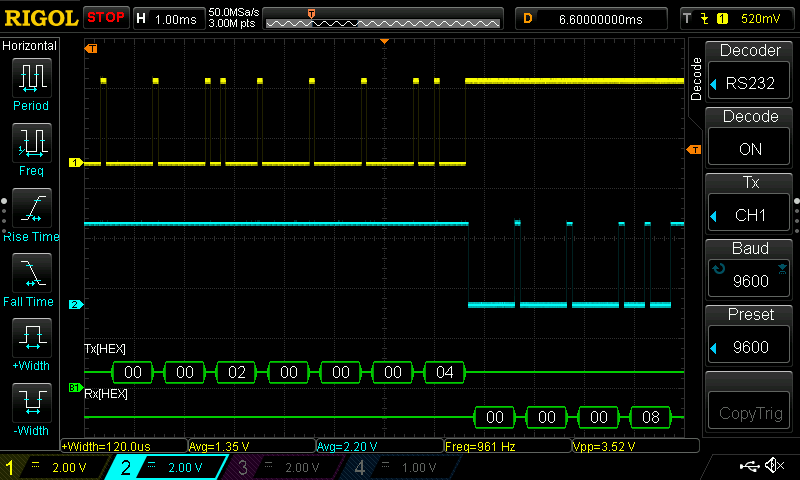

# UART Example

This project demonstrates how to get UART working on an FPGA.

## Dependencies

* <https://github.com/YosysHQ/oss-cad-suite-build/releases>
* <https://github.com/zachjs/sv2v/releases>

## Running

```bash
git submodule update --init --recursive

# simulate with Verilator
make sim

# Icebreaker synthesis with Yosys/Icestorm, then simulate with Verilator
make icestorm_icebreaker_gls
# program Icebreaker volatile memory
make icestorm_icebreaker_program
# program Icebreaker non-volatile memory
make icestorm_icebreaker_flash
```

## UART Demo

```bash
# First, program the Icebreaker
# Assuming the icebreaker is connected to /dev/ttyUSB1:

# Set Icebreaker FTDI to 9600 baud, 8 data bits, 1 stop bit, no pairity, and no extra processing
stty -F /dev/ttyUSB1 9600 cs8 -cstopb -parenb raw -echo
# Continuously read data from Icebreaker FTDI (format as 4-byte hex)
cat /dev/ttyUSB1 | xxd -p -c 4 &
# Send multiplication command to Icebreaker (2 × 4)
printf "\x00\x00\x00\x02\x00\x00\x00\x04" > /dev/ttyUSB1
```


